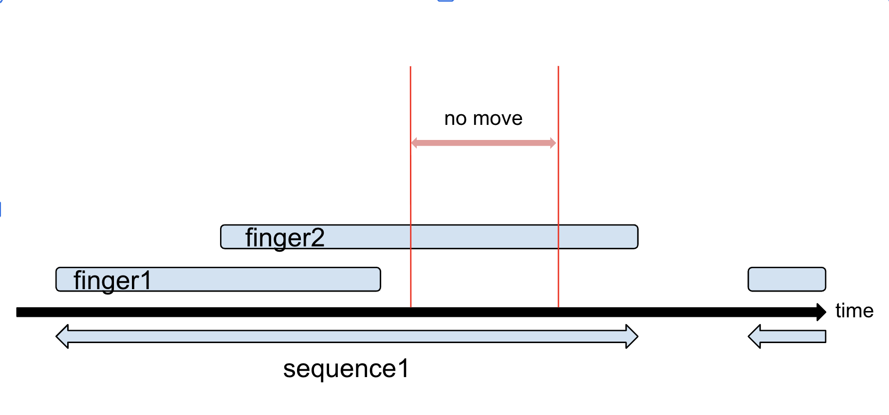
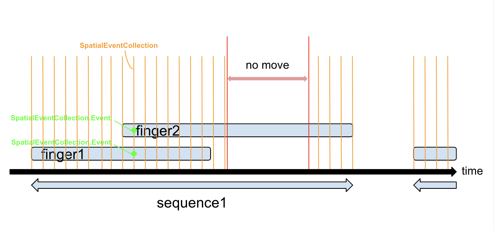
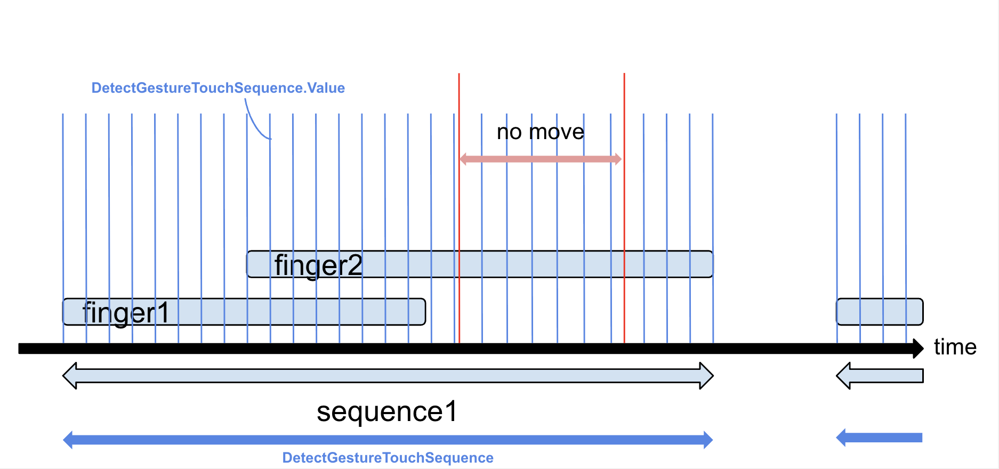
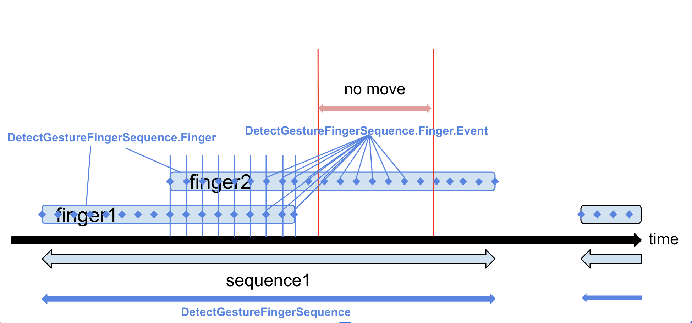

# Simple Document

## Introduction: detectGesture() is a wrapper of SpatialEventGesture (Official API).

```swift
// SpatialEventGesture (Official API)
SomeView()
    .gesture(
        SpatialEventGesture()
            .onChanged { eventCollection in // : SpatialEventCollection

            }
            .onEnded { eventCollection in

            }
    )
)
```

```swift
// detectGesture()
SomeView()
    .detectGesture(
        MyGesture.self,
        detect: { state in // : DetectGestureState

        },
        handle: { state in

        }
    )
)
```

`SpatialEventGesture` is the official API for handling multi-finger gestures ([doc](https://developer.apple.com/documentation/swiftui/spatialeventgesture)).
`detectGesture()` is a wrapper around `SpatialEventGesture`.

`detectGesture()` internally monitors `SpatialEventGesture` and calls `detect: {}` and `handle: {}` when onChanged or onEnded are triggered.
The new values passed (`SpatialEventCollection`) are wrapped in `DetectGestureValue`, stored in the `gestureValues: [DetectGestureTouchSequence.Value]` property within `DetectGestureState`, and passed as closure arguments.

## SpatialEventGesture (Official API) Specifications



- `SpatialEventCollection`: Stores `[SpatialEventCollection.Event]`, which contains gesture information for each finger at that point in time.
- `SpatialEventCollection.Event`: Information for a single finger. Each has an id, and the same finger will have the same id value.
  - [Note] The uniqueness of the id is only guaranteed within the same sequence. The same value may be reused in different sequences.
- [Note] onUpdated/onEnded are not called while the finger is not moving.

## DetectGesture (This API)



- `DetectGestureTouchSequence.Value`: `SpatialEventCollection` + additional custom information. See the [definition](../Sources/Feature/DetectGesture/State/GesutureValue/DetectGestureValue.swift) for details.
- `DetectGestureTouchSequence`: A single sequence. Stores `[DetectGestureTouchSequence.Value]`.
- Unlike `SpatialEventGesture`, new values are generated even while the finger is not moving, and `detect: {}` and `handle: {}` are called.

## Conversion Utilities

The `DetectGestureState` passed to the `detectGesture()` closure stores tap information in the `gestureValues: [DetectGestureTouchSequence.Value]` property. If it's difficult to use as-is, you can convert it to one of the following utility types.

### Group by Sequence

Can be converted to `[DetectGestureTouchSequence]`.

### Group by Finger



- Can be converted to `[DetectGestureFingerSequence]` type, which organizes information by finger.
- This type is convenient, so it's often converted to this type before use.
- `DetectGestureFingerSequence`, `DetectGestureFingerSequence.Finger`, `DetectGestureFingerSequence.Finger.Event`: As shown in the diagram.

### Convert for Pinch

- Can be converted to `[DetectGesturePinchCollection]` type for pinch gestures.

### Other Conversions

Created the ones that seem necessary.
